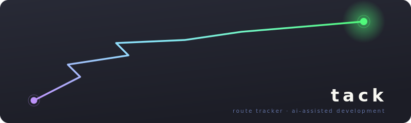

<p align="center">
  
</p>

tack captures the non-linear reality of how development actually happens — pivots, context switches, multi-repo changes — so that work-in-progress survives context exhaustion, crashes, and session boundaries.

## Installation

### Claude Code Plugin

```bash
claude plugins marketplace add https://github.com/chris-peterson/claude-marketplace
claude plugins install tack@claude-marketplace
```

### CLI Only

```bash
npm install -g tack
```

## Quick Start

```bash
# Create a route
tack init auth-rewrite

# Add tacks (units of work)
tack add auth-rewrite "Replace session middleware" --project org/api-server
tack add auth-rewrite "Update client SDK" --project org/sdk --depends-on t1

# Track pre-work and post-work todos
tack before auth-rewrite t1 "Read compliance requirements"
tack after auth-rewrite t1 "Notify security team"

# Start working
tack todo done auth-rewrite t1 b1
tack start auth-rewrite t1

# Attach the deliverable (the change request)
tack deliverable auth-rewrite t1 "Session middleware PR" https://github.com/org/api-server/pull/42

# Add reference links
tack link auth-rewrite t1 "Design doc" https://docs.example.com/auth-design

# Complete
tack done auth-rewrite t1

# Check status
tack status auth-rewrite
```

## Data Model

```
Route (1 YAML file per route)
├── id (UUID), slug, created_at, updated_at
├── group (optional grouping slug)
├── depends_on: [route slugs]
└── tacks[]
    ├── id (t1, t2, ...), summary, status
    ├── project, done_at
    ├── depends_on: [tack IDs]
    ├── deliverable — the change request
    │   └── label, url
    ├── before[] — pre-work todos
    │   └── id (b1, b2, ...), text, done, done_at
    ├── after[] — post-work todos
    │   └── id (a1, a2, ...), text, done, done_at
    └── links[] — references
        └── label, url
```

Routes are stored as YAML files in `~/.tack/routes/`.

## CLI Reference

| Command | Description |
|---|---|
| `tack init <slug> [--group <slug>]` | Create a new route |
| `tack status [slug]` | Show route details (or all routes) |
| `tack list` | List all routes with open/total counts |
| `tack recent [--count <n>] [--since <date>]` | List routes by most recently updated |
| `tack add <slug> <summary> [opts]` | Add a tack (`--project`, `--depends-on`) |
| `tack start <slug> <tack-id>` | Start a tack (checks dependencies) |
| `tack done <slug> <tack-id>` | Complete a tack |
| `tack drop <slug> <tack-id>` | Drop a tack |
| `tack deliverable <slug> <tack-id> <label> <url>` | Set the change request |
| `tack before <slug> <tack-id> <text>` | Add a pre-work todo |
| `tack after <slug> <tack-id> <text>` | Add a post-work todo |
| `tack todo done <slug> <tack-id> <todo-id>` | Complete a todo |
| `tack todo drop <slug> <tack-id> <todo-id>` | Remove a todo |
| `tack link <slug> <tack-id> <label> <url>` | Add a reference link |
| `tack rm <slug> [--force]` | Delete a route |

## Design Principles

- **The schema is the product.** The CLI is a convenience wrapper. Any tool that reads/writes conforming YAML is a first-class citizen.
- **One file per route.** Easy to list, archive, delete, or version-control.
- **Flat over nested.** A tack is one unit of work with one deliverable. No sub-items.
- **Dependencies, not workflows.** Tacks declare what they depend on. No enforced state machine.
- **Local only.** No server, no sync, no cloud.

## License

MIT
