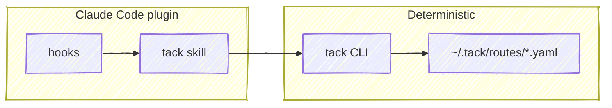

# tack — Specification

tack v1 is a tool-agnostic route schema with a deterministic CLI and a
Claude Code plugin that layers reasoning on top.

> [!TIP]
> View the full spec source: [spec/v1/SPEC.md](https://github.com/chris-peterson/tack/blob/main/spec/v1/SPEC.md)

## Architecture



The CLI and YAML schema are the durable, tool-agnostic layer — the CLI does
nothing beyond schema CRUD. The plugin is the Claude-Code-specific surface
that picks the active route, captures URLs, and resolves ambiguity by
prompting the user. Other agents or tools can target the same schema by
speaking to the CLI directly.

## Data Model

```text
Route (1 YAML file per route)
├── id (UUID), slug, created_at, updated_at
├── group (optional grouping slug)
├── depends_on: [route slugs]
├── sessions[]
│   └── id, started_at, tacks[] — route-scoped tack IDs the session is driving
└── tacks[]
    ├── id (t1, t2, ...), summary, status
    ├── done_at
    ├── depends_on: [tack IDs]
    ├── deliverable — the change request
    │   └── label, url
    ├── before[] — pre-work todos
    │   └── id (b1, b2, ...), text, done, done_at
    ├── after[] — post-work todos
    │   └── id (a1, a2, ...), text, done, done_at
    └── links[] — references
        └── label, url
```

## Requirement Categories

| Category | Description |
|---|---|
| RTE | Route schema structure and constraints |
| TACK | Tack fields, statuses, and ID sequencing |
| DEL | Deliverable (single change request per tack) |
| TODO | Todo items (before/after arrays with IDs) |
| DEP | Dependency tracking and enforcement |
| LINK | Link structure (label + url) |
| STG | Storage location, directory creation, validation, cwd pointer file |
| CLI | CLI commands and output behavior |
| AGT | Claude Code agent integration (skill responsibilities) |
| HOOK | Hook responsibilities (nudges, freshness checks) |
| REPO | Repo database (name→remote index, captured as work is observed) |

## Anti-Requirements

Explicitly out of scope:

- No project management (sprints, epics, story points)
- No time tracking
- No git operations
- No enforced workflows beyond dependency constraints
- No server, sync, or cloud
- No cross-route dependency enforcement
