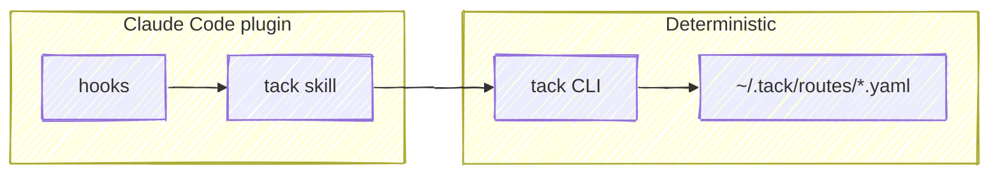

# tack — Specification

tack v1 is a tool-agnostic route schema with a deterministic CLI and a
Claude Code plugin that layers reasoning on top.

> [!TIP]
> View the full spec source: [spec/v1/SPEC.md](https://github.com/chris-peterson/tack/blob/main/spec/v1/SPEC.md)

## Architecture


```mermaid
%%{ init: { 'look': 'handDrawn' } }%%
flowchart LR
    subgraph deterministic ["Deterministic"]
        cli["tack CLI"]
        schema["~/.tack/routes/*.yaml"]
        cli --> schema
    end

    subgraph plugin ["Claude Code plugin"]
        hooks["hooks"]
        skill["tack skill"]
        hooks --> skill
    end

    skill --> cli
```

The CLI and YAML schema are the durable, tool-agnostic layer — the CLI does
nothing beyond schema CRUD. The plugin is the Claude-Code-specific surface
that picks the active route, captures URLs, and resolves ambiguity by
prompting the user. Other agents or tools can target the same schema by
speaking to the CLI directly.

## Data Model

```text
Route (1 YAML file per route)
├── id (UUID), slug, created_at, updated_at
├── title (optional display name), description (optional markdown)
├── group (optional grouping slug)
├── depends_on: [route slugs]
├── sessions[]
│   └── id, started_at, tacks[] — route-scoped tack IDs the session is driving
└── tacks[]
    ├── id (t1, t2, ...), summary, status
    ├── done_at
    ├── depends_on: [tack IDs]
    ├── deliverable — the change request
    │   └── label, url
    ├── before[] — pre-work todos
    │   └── id (b1, b2, ...), text, done, done_at
    ├── after[] — post-work todos
    │   └── id (a1, a2, ...), text, done, done_at
    └── links[] — references
        └── label, url
```

## Requirement Categories

| Category | Description |
|---|---|
| ROUTE | Route schema structure and constraints |
| TACK | Tack fields, statuses, and ID sequencing |
| DEL | Deliverable (single change request per tack) |
| TODO | Todo items (before/after arrays with IDs) |
| DEP | Dependency tracking and enforcement |
| LINK | Link structure (label + url) |
| STORE | Storage location, directory creation, validation, cwd pointer file |
| CLI | CLI commands and output behavior |
| AGT | Claude Code agent integration (skill responsibilities) |
| HOOK | Hook responsibilities (nudges, freshness checks) |
| REPO | Repo database (name→remote index, captured as work is observed) |
| COMPAT | What a `1.x` release freezes, and what it leaves free to change |

## Compatibility

A tack consumer — a script, an agent, a dashboard reading the YAML — lives
outside this repo and can't be updated in step with it. `1.x` freezes four
surfaces for them: the route schema, the CLI grammar, exit codes, and `--json`
output shapes. Those grow by addition only; anything that removes, renames, or
narrows them waits for a major.

Left free to move: human-readable output, error wording, the CLI's own
bookkeeping files (`~/.tack/pins.yaml`, `~/.tack/repos.yaml`), and the Claude
Code plugin's prose.

The full contract — including which changes are additive, and the one-way
direction of file compatibility — is the COMPAT category in
[spec/v1/SPEC.md](https://github.com/chris-peterson/tack/blob/main/spec/v1/SPEC.md).

## Anti-Requirements

Explicitly out of scope:

- No project management (sprints, epics, story points)
- No time tracking
- No git operations
- No enforced workflows beyond dependency constraints
- No server, sync, or cloud
- No cross-route dependency enforcement
