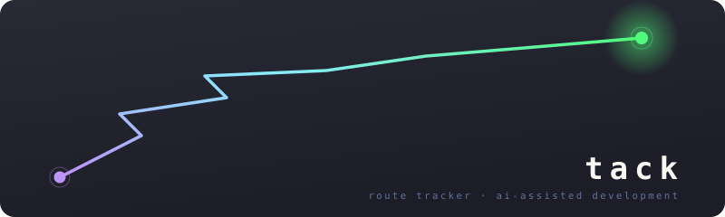

<p align="center">
  
</p>

[](_home.md ':include')

## In action

You stepped away mid-refactor and burned through the context window. Next morning, `/tack:tack` replays exactly where you stopped — no re-explaining:

<div class="cw-session" data-cw-session="session"></div>

The two moves you reach for most — resuming a route and capturing a deliverable as it ships:

<div class="cw-session" data-cw-session="examples"></div>

## The CLI

The plugin bundles the CLI. To make `tack` callable from any shell, run `/tack:tack install-cli` once — it drops a `tack` wrapper at `~/.local/bin/tack` and installs the zsh completions. Without the plugin, the same binary is on npm as `tack`.

```bash
tack init auth-rewrite

tack add auth-rewrite "Replace session middleware"
tack add auth-rewrite "Update client SDK" --depends-on t1

tack before auth-rewrite t1 "Read compliance requirements"
tack start auth-rewrite t1

tack deliverable auth-rewrite t1 "Session middleware PR" https://github.com/org/api-server/pull/42
tack done auth-rewrite t1

tack status auth-rewrite
```

## Data Model

```text
Route (1 YAML file per route)
├── id (UUID), slug, created_at, updated_at
├── group (optional grouping slug)
├── depends_on: [route slugs]
├── sessions[]
│   └── id, started_at, tacks[] — route-scoped tack IDs the session is driving
└── tacks[]
    ├── id (t1, t2, ...), summary, status
    ├── done_at
    ├── depends_on: [tack IDs]
    ├── deliverable — the change request
    │   └── label, url
    ├── before[] — pre-work todos
    │   └── id (b1, b2, ...), text, done, done_at
    ├── after[] — post-work todos
    │   └── id (a1, a2, ...), text, done, done_at
    └── links[] — references
        └── label, url
```

Routes are stored as YAML files in `~/.tack/routes/`.

## Design Principles

- **The schema is the product.** The CLI is a convenience wrapper. Any tool that reads/writes conforming YAML is a first-class citizen.
- **One file per route.** Easy to list, archive, delete, or version-control.
- **Flat over nested.** A tack is one unit of work with one deliverable. No sub-items.
- **Dependencies, not workflows.** Tacks declare what they depend on. No enforced state machine.
- **Local only.** No server, no sync, no cloud.

## Reference

- [SPEC](/spec) — the requirements, with formal IDs; [v1](/spec/v1) is the frozen contract the CLI implements
- [CLI reference](/cli) — every command, subcommand, and flag
- [Examples & visualizations](/examples) — sample routes, and the views (Sankey, dependency graph, Gantt) derived from them
- **Skills** — [`/tack:start`](/skills/start), [`/tack:end`](/skills/end), and [`/tack:tack`](/skills/tack), sourced from each `SKILL.md`
- [Hooks](/hooks) — what the plugin does without being asked, and the scripts each hook runs
- [Coverage](/status) — which requirements are implemented, and where
