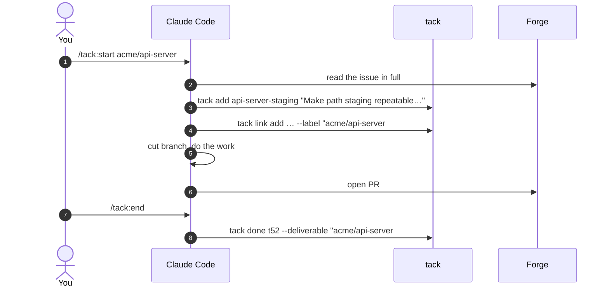
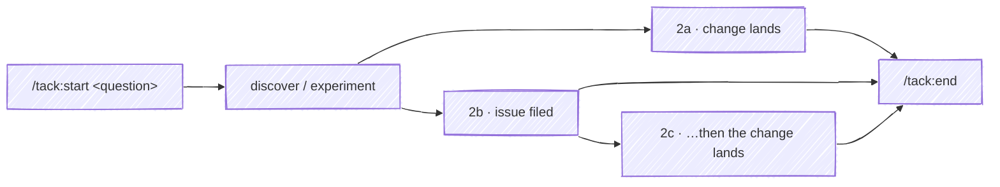
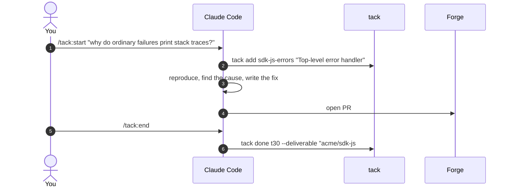
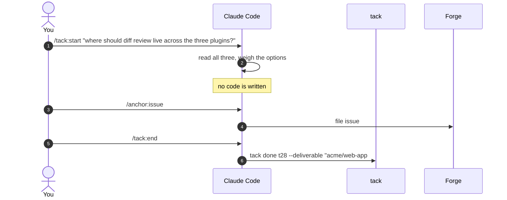
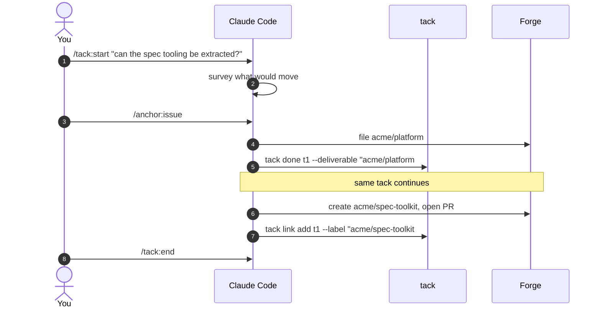
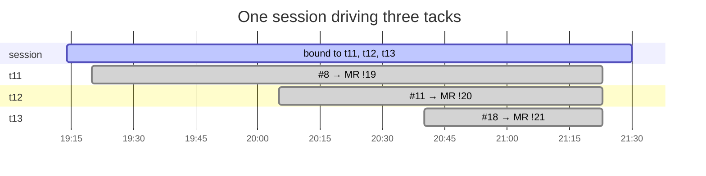

# Anatomy of a tack

## What is a tack?

**A tack is a single path to a single deliverable.**

- **Single path** — one line of work from opening to landing. It can span
  sessions, days, and repositories; it doesn't branch. When the work forks, the
  fork is a second tack.
- **Single deliverable** — one thing that lands and can be linked to: a merge
  request, a commit, a release, or a filed issue. Two things landing means two
  tacks.

That's the whole rule. Everything below is the shapes that rule takes in
practice.

### What a tack is not

| Not | Because |
|---|---|
| A session | The two are independent: one session can drive several tacks, one tack can span several sessions, a session can produce no tack, and a tack can have no session — see [One session is not one tack](#one-session-is-not-one-tack). |
| A ticket | A ticket is what someone asked for. A tack is one path to answering it, and a ticket can take several. |
| A task list | Tacks are flat. There are no sub-items; a step that needs its own deliverable is its own tack. |
| A status | `pending` / `done` describes where a tack got to, not what it is. A tack with no deliverable yet is still a tack. |

## The shapes

| Shape | Opens with | Lands as |
|---|---|---|
| [Tracked](#shape-1-tracked) | an issue you already have | a merge request or commit |
| [Exploratory → deliverable](#shape-2a-exploratory-deliverable) | a question | a merge request or commit |
| [Exploratory → issue](#shape-2b-exploratory-issue) | a question | a filed issue |
| [Exploratory → issue → deliverable](#shape-2c-exploratory-issue-deliverable) | a question | a filed issue, then the change that answers it |

The tracked shape is the one other tools already handle — an issue tracker knows
about it before you start. The exploratory shapes are why a route tracker
exists: work that had no ticket when it began, and may still have none when it
lands.

## Shape 1: Tracked

You have an issue, you do the work, it lands as a change request.



The issue arrives as a **link**; the merge request lands as the
**deliverable**. That asymmetry is the whole record: the link says what asked
for the work, the deliverable says what answered it.

```yaml
- id: t52
  summary: Make path staging repeatable so /commit survives a deleted file
  status: done
  done_at: 2026-08-21T14:24:13.539Z
  deliverable:
    label: acme/api-server #82
    url: https://forge.example/acme/api-server/-/merge_requests/82
  links:
    - label: acme/api-server #76
      url: https://forge.example/acme/api-server/-/issues/76
```

## Shape 2: Exploratory

You open with a question rather than a ticket. What the tack lands as depends on
what you find.



### Shape 2a: Exploratory → deliverable

The question turns out to have an answer you can just write. Nothing is filed
first, because by the time you know what to file you have already fixed it.



No `links` entry, because nothing asked for this. The tack is the only record
that the question was ever asked.

### Shape 2b: Exploratory → issue

The exploration **is** the deliverable. You looked into something, reached a
conclusion, and the artifact is a filed issue — nothing lands in a repository.



```yaml
- id: t28
  summary: Resolve where diff review lives across the three plugins
  status: done
  done_at: 2026-07-30
  deliverable:
    label: acme/web-app #19
    url: https://forge.example/acme/web-app/-/issues/19
```

A filed issue in the `deliverable` slot is the signal that this was a decision,
not a change. It reads as done because it is: the question is answered and
written down.

### Shape 2c: Exploratory → issue → deliverable

Shape 2b, and then the work gets done. The tack stays one tack, because it is
still one path to one outcome — the issue is where the outcome was recorded
first.



```yaml
- id: t1
  summary: Extract spec-driven toolkit
  status: done
  done_at: 2026-05-18T23:24:30.798Z
  deliverable:
    label: acme/platform #6
    url: https://forge.example/acme/platform/-/issues/6
  links:
    - label: acme/spec-toolkit
      url: https://forge.example/acme/spec-toolkit
    - label: acme/spec-toolkit#3
      url: https://forge.example/acme/spec-toolkit/-/merge_requests/3
```

> [!NOTE]
> Shape 2c has a fork in it. The follow-on work is a `link` here, which keeps it
> on one tack — right when the delivery is the same path continuing. When the
> delivery is separate work that a later route picks up, make it its own tack
> and point at the issue with `depends_on`.

## One session is not one tack

A session is a conversation; a tack is a deliverable. They cross freely, and
`tack` records them on separate axes so a fleet view can tell which session is
driving which tack.

One session, three tacks — three issues read, three branches cut, three merge
requests opened, all landed within the same afternoon:



And the reverse — one tack across many sessions — is the case the route file
exists for. A tack that takes a week of interrupted work carries the same
deliverable at the end of it; the sessions accumulate on the route.

A route file says nothing about sessions. Each session is its own file, holding
what it did:

```yaml
# 2026/sessions/5b1f8a2c-9d3e-4f71-b0c4-2e8a1d6f3b90.yaml
id: 5b1f8a2c-9d3e-4f71-b0c4-2e8a1d6f3b90
started_at: 2026-07-04T19:14:44.118Z
ended_at: 2026-07-04T23:02:10.004Z
routes: [q2-auth-rewrite, q2-dependency-cleanup, tangent-ci-flake]
tacks: [q2-auth-rewrite/t11, q2-auth-rewrite/t12, tangent-ci-flake/t1]
```

The `tacks` array is in touch order, and its last entry is what that session was
driving last. The refs carry a slug because a session's tacks land wherever they
belong: that one produced two on the auth rewrite and one on a tangent it opened
along the way, so its record can't live inside either route.

`routes` is the touch list, and it is a superset of the slugs in `tacks` — this
session drove work on two routes and also looked in on a third.

A session earns its file by driving a tack. The common conversation — open a
route, read around, exit — leaves none, which is the honest record of it: the
[table below](#sessions-and-tacks-are-independent) is the same point from the
other side.

`ended_at` appears when `/tack:end` closes the session. Until then the session
reads as live — which is the distinction a dashboard needs, since a session
that stopped talking and a session still working look identical from the
outside.

### Sessions and tacks are independent

Both cases above assume a session is doing tack-shaped work. It need not be:

| The session | Produces |
|---|---|
| Answers a one-off question | nothing |
| Reads code to explain how something works | nothing |
| Talks through a design and reaches no conclusion | nothing |
| Leaves a comment on an existing issue | nothing tack records |
| Fixes a typo you never intend to track | nothing |

None of that is a gap. A session that answered a question did its job, and
there is nothing to pin. It never reaches a route file, and the route file is
not missing anything.

It runs the other way too — a tack needs no session at all:

```bash
tack add api-server-staging "Make path staging repeatable"
```

That creates a tack from a shell prompt, with no session recorded against it
and no AI tool involved. `sessions` is optional in the schema, and a route that
never carries one is as complete as any other.

So **neither implies the other**. A route file records what landed; a session
log, where one exists, records what happened. They are separate artifacts and
either can exist without the other.

## Choosing the shape

You don't declare a shape anywhere — it's read back off the fields:

| Field pattern | Shape |
|---|---|
| `links` holds an issue, `deliverable` is a CR | Tracked |
| No `links`, `deliverable` is a CR or commit | Exploratory → deliverable |
| `deliverable` is an issue, no CR anywhere | Exploratory → issue |
| `deliverable` is an issue, `links` holds a CR | Exploratory → issue → deliverable |

This is why the deliverable is a single slot rather than a list. "What did this
land as?" has one answer, and which kind of URL fills it is what tells you how
the work went.

## tack records; it does not prescribe

Every shape on this page describes work that happened. None of them is a
procedure to follow. There is no state machine, no required order, no step tack
will refuse to let you skip, and no opinion about whether you should have filed
an issue before writing code.

The diagrams above show Claude Code driving the CLI, because that is what the
`/tack:start` and `/tack:end` skills do. They are *a* way in, not *the* way in:
every step in them is a `tack` command you can run yourself, and the schema
carries no assumptions about Claude Code or any other tool. A route maintained
entirely by hand, or by some other editor, is a first-class route.

What tack does hold you to is narrow:

- a tack names one deliverable
- a route holds tacks
- a dependency points at a tack, in this route or another one

Everything else is yours: when a tack opens, whether the work had a ticket, how
many sessions it takes, whether a session produces one at all.

That restraint is what keeps the record worth reading. A tracker that enforced
a workflow would collect evidence of the workflow it enforced. One that only
observes collects what you actually did — which is the difference between the
views in [Examples & Visualizations](/examples) showing your work and showing
your compliance.

## See also

- [Working a tack route](/guides/routes) — resolving the active route and
  binding a session to a tack
- [start](/skills/start) and [end](/skills/end) — the skills that open and close
  a tack
- [Examples & Visualizations](/examples) — what a set of routes looks like
  rendered
