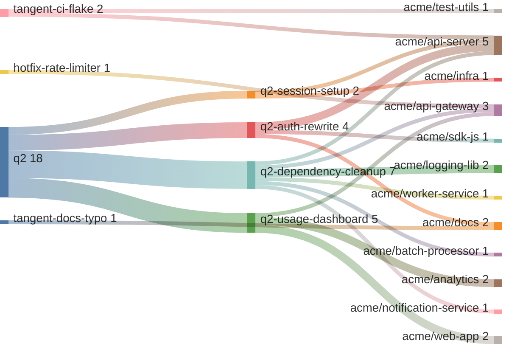
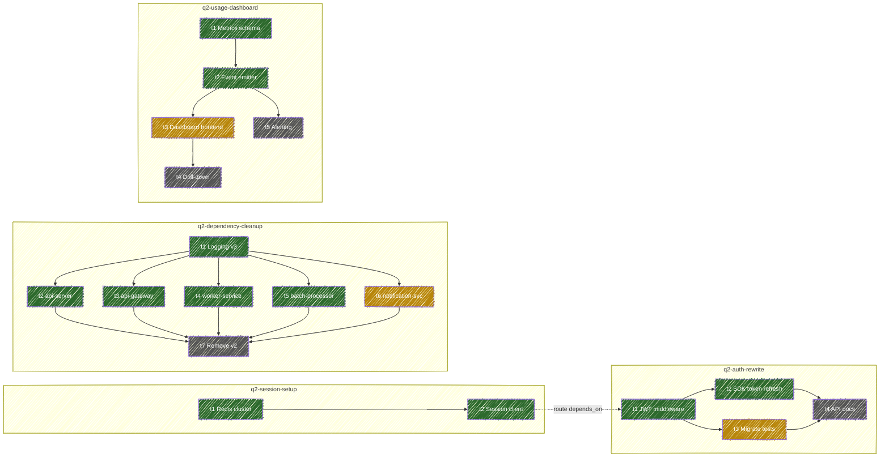
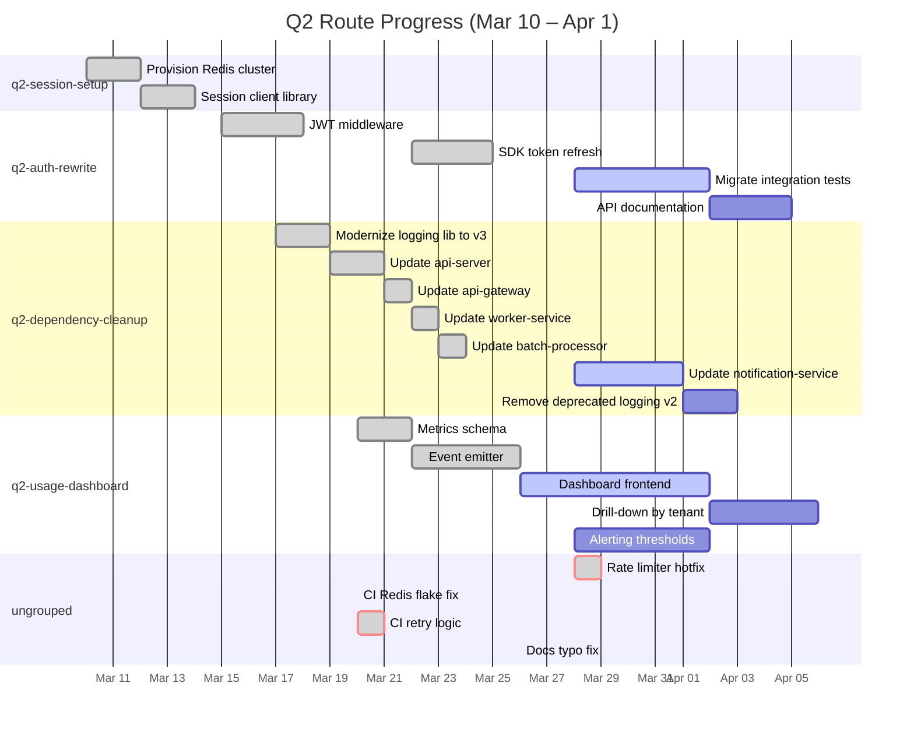

# Examples & Visualizations

The tack schema is intentionally view-agnostic. The same YAML files can power different visualizations depending on context. This page shows seven example routes rendered as five views — all derived from schema fields alone.

Source files: [`examples/`](https://github.com/chris-peterson/tack/tree/main/examples)

---

## View: Effort Flow (Sankey)

Shows how work flows from group through routes into projects. Each link is weighted by tack count. Ungrouped routes appear individually.

Reads left to right: group → route → project. The width of each flow is proportional to tack count. `q2-dependency-cleanup` fans out the widest (7 tacks across 6 repos), and `acme/api-server` receives work from three different routes.

---

## View: Dependency Graph

Shows both intra-route and cross-route dependencies. The `q2-dependency-cleanup` route demonstrates the fan-out pattern: one library upgrade cascading to five consumer updates — a pattern no single-repo issue tracker captures well.

**Color key:** green = done, amber = in progress, grey = pending.

---

## View: Quarterly Report (Gantt)

Maps tack completion dates onto a timeline. Routes become sections; tacks become bars. Ungrouped work renders as `crit` to highlight interruptions.

Timespans are derived from `created_at` and `done_at` — no timeframe field needed.

Ungrouped work (`crit` bars) appears as interruptions in the grouped timeline — useful for retrospectives to quantify reactive vs. intentional work.

---

## Deriving Views from Schema

> [!NOTE]
> Every visualization on this page maps directly to schema fields. No view requires data outside the schema. Any tool that reads conforming YAML can produce these visualizations.

| View | Key fields used |
|------|----------------|
| Effort flow (Sankey) | `group`, `slug`, `tacks[].deliverable.url` |
| Dependency graph | `depends_on` (route + tack level), `tacks[].status` |
| Quarterly Gantt | `created_at`, `tacks[].done_at`, `tacks[].depends_on`, `group` |

Time is always derived from timestamps on tacks and deliverables — never declared. Quarterliness is a reporting concern, not a schema concern.
