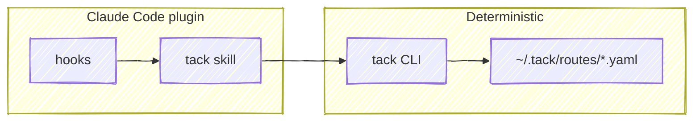

# tack — Route Schema Specification (v1)

## Overview

tack is a tool-agnostic route schema for tracking AI-assisted development
work. A route captures the non-linear, multi-project reality of how
development actually happens — pivots, context switches, expanding scope — so
that work-in-progress survives context exhaustion, crashes, and session
boundaries.

The schema is the primary deliverable. The CLI encapsulates schema
operations as a deterministic primitive. A separate Claude Code plugin
bundles hooks and a skill that layer reasoning on top — picking the active
route, prompting on ambiguity, capturing URLs — using the CLI as its only
write path.



The CLI and YAML schema are the durable, tool-agnostic layer. The plugin is
a Claude-Code-specific surface that wraps the CLI; other agents or tools can
target the same schema by speaking to the CLI directly.

---

## Data Model

```
Route (1 YAML file)
├── id (UUID), slug, created_at, updated_at
├── group (optional grouping slug)
├── depends_on: [route slugs]
├── sessions[]
│   └── id, started_at
└── tacks[]
    ├── id (t1, t2, ...), summary, status
    ├── done_at
    ├── depends_on: [tack IDs]
    ├── deliverable — the change request
    │   └── label, url
    ├── before[] — pre-work todos
    │   └── id (b1, b2, ...), text, done, done_at
    ├── after[] — post-work todos
    │   └── id (a1, a2, ...), text, done, done_at
    └── links[] — references (docs, issues, threads, etc.)
        └── label, url
```

---

## Requirements

### RT — Route Schema

**[RT-01]** The route schema shall use YAML as the on-disk format.

**[RT-02]** Each route shall be stored as a single file at
`~/.tack/routes/<slug>.yaml`.

**[RT-03]** Each route shall contain the following required fields:
- `id` (string) — a v4 UUID, generated once at creation time
- `slug` (string) — unique identifier, lowercase, hyphenated
- `created_at` (string) — ISO 8601 timestamp
- `updated_at` (string) — ISO 8601 timestamp
- `tacks` (array) — list of tack objects

**[RT-04]** Each route shall contain the following optional fields:
- `group` (string) — a grouping slug for associating related routes. Multiple
  routes may share the same group. Uses the same format as `slug` (lowercase,
  hyphenated). The field is purely organizational — the CLI does not enforce or
  validate group membership.
- `depends_on` (array of strings) — slugs of routes that must complete before
  this one can proceed

**[RT-05]** The `slug` field shall be unique across all route files in
`~/.tack/routes/`. When a slug matches an existing filename, the operation
shall fail with an error.

**[RT-06]** The `updated_at` field shall be set to the current time whenever
the route file is written.

**[RT-07]** A route shall be valid with an empty `tacks` array.

**[RT-08]** The `id` field shall be immutable after creation. It shall not
change when the route is updated.

**[RT-09]** Each route shall contain the following optional field:
- `sessions` (array) — Claude Code session references that touched this route

**[RT-10]** Each session entry shall contain the following required fields:
- `id` (string) — the Claude Code session identifier
- `started_at` (string) — ISO 8601 timestamp when the session first touched
  this route

---

### TK — Tacks

**[TK-01]** Each tack shall contain the following required fields:
- `id` (string) — route-scoped identifier in the format `t<N>` where N is a
  sequential integer starting at 1
- `summary` (string) — human-readable description of the work
- `status` (string) — one of: `pending`, `in_progress`, `done`, `blocked`,
  `dropped`

**[TK-02]** Each tack shall contain the following optional fields:
- `done_at` (string) — ISO 8601 date (`YYYY-MM-DD`) or date-time
  (`YYYY-MM-DDTHH:MM:SSZ`) when the tack was completed. The CLI writes the
  full date-time on new completions; bare dates are accepted on read for
  backward compatibility with routes created before v0.11.0.
- `depends_on` (array of strings) — IDs of tacks within the same route that
  must complete first
- `deliverable` (object) — the change request this tack produces
- `before` (array) — pre-work todo items
- `after` (array) — post-work todo items
- `links` (array) — external references

**[TK-03]** When `status` is set to `done`, the `done_at` field shall be set
to the current ISO 8601 date-time if not already present. Callers may supply
an explicit timestamp (date or date-time) per [CL-05] to backfill already-merged
work.

**[TK-04]** When `status` is set to `done`, if the tack has `after` items with
`done: false`, those items shall be surfaced in the response so the calling
agent can confirm or close them out. The CLI persists the status change before
displaying the pending items; gating responsibility lies with the caller.

**[TK-05]** Tack IDs shall be unique within a route. When a new tack is
added, its ID shall be `t<N>` where N is one greater than the highest existing
tack number.

**[TK-06]** When a tack's `depends_on` references a tack ID that does not
exist in the route, the operation shall fail with an error.

**[TK-07]** When a tack's `depends_on` references would create a circular
dependency, the operation shall fail with an error.

---

### DV — Deliverable

**[DV-01]** Each tack shall have at most one deliverable. The deliverable
represents the change request (PR/MR) that the tack produces.

**[DV-02]** Each deliverable shall contain the following required fields:
- `label` (string) — short display text
- `url` (string) — full URL

---

### TD — Todo Items

**[TD-01]** Todo items appear in two arrays on a tack: `before` (pre-work)
and `after` (post-work). Both arrays use the same item schema.

**[TD-02]** Each todo item shall contain the following required fields:
- `id` (string) — scoped identifier: `b<N>` for before items, `a<N>` for
  after items, where N is a sequential integer starting at 1
- `text` (string) — description of the instruction
- `done` (boolean) — whether the instruction has been completed

**[TD-03]** Each todo item shall contain the following optional fields:
- `done_at` (string) — ISO 8601 date (`YYYY-MM-DD`) or date-time
  (`YYYY-MM-DDTHH:MM:SSZ`) when completed. New writes use the full date-time;
  bare dates remain valid on read.

**[TD-04]** When `done` is set to `true`, the `done_at` field shall be set to
the current ISO 8601 date-time if not already present.

**[TD-05]** Todo IDs shall be unique within their respective array (before or
after). When a new todo is added, its ID shall use the next sequential number
for that array's prefix.

---

### DP — Dependencies

**[DP-01]** Route-level `depends_on` shall be an array of route slugs
(strings).

**[DP-02]** Tack-level `depends_on` shall be an array of tack IDs within the
same route.

**[DP-03]** When a tack has `depends_on` entries and any referenced tack has a
status other than `done`, the dependent tack's status shall not be set to
`in_progress` — the operation shall fail with an error indicating which
dependencies are unmet.

**[DP-04]** Route-level dependencies shall be informational. The CLI shall
display them in `tack status` output but shall not enforce them (the referenced
route files may not exist locally).

---

### LK — Links

**[LK-01]** Each link shall contain the following required fields:
- `label` (string) — short display text
- `url` (string) — full URL

---

### ST — Storage

**[ST-01]** Route files shall be stored in `~/.tack/routes/`.

**[ST-02]** The storage directory shall be created automatically on first use
if it does not exist.

**[ST-03]** Route filenames shall match the pattern `<slug>.yaml`.

**[ST-04]** The JSON Schema at `schema/route.schema.json` shall be the
canonical validation source for route files.

**[ST-05]** When reading a route file, the CLI shall validate it against the
JSON Schema. If validation fails, the CLI shall report the errors and exit
without modifying the file.

**[ST-06]** A pointer file at `<cwd>/.tack` shall record the active route
for a working directory. The file is YAML with the following fields:
- `slug` (string, required) — the pinned route's slug
- `pinned_at` (string, required) — ISO 8601 timestamp of when the pin was
  written
- `session_id` (string, optional) — informational; the Claude Code session
  that wrote the pin

The pointer file is per-cwd state, not part of the route schema. Users may
commit it to share assignment across a team or `.gitignore` it for per-dev
state. The CLI does not opine on either choice.

---

### CL — CLI

**[CL-01]** The CLI shall be invoked as `tack <command> [options]`.

**[CL-02]** `tack init <slug> [--group <slug>]` — When invoked, the CLI shall
create a new route file at `~/.tack/routes/<slug>.yaml` with a generated v4
UUID as `id`, an empty `tacks` array, and `created_at`/`updated_at` set to
the current time. When `--group` is passed, the route's `group` shall be set
to the given slug.

**[CL-03]** `tack status [slug] [--all]` — When invoked with a slug, the CLI
shall display the route's tacks, their statuses, dependencies, deliverable,
and any pending todo items. Tacks with status `dropped` shall be omitted by
default; when `--all` is passed, dropped tacks shall be included. When invoked
without a slug, the CLI shall display a summary of all routes.

**[CL-04]** `tack add <slug> <summary> [--depends-on <id,...>] [--done] [--date <ts>] [--deliverable <url>]` —
When invoked, the CLI shall add a new tack to the specified route with the
next sequential ID. When `--done` is passed, the tack shall be created with
status `done` and `done_at` set to the current ISO 8601 date-time, or to the
explicit value of `--date <ts>` (a `YYYY-MM-DD` date or full ISO 8601
date-time) when supplied — this is the supported path for backfilling
already-merged work. When `--deliverable <url>` is passed, the tack shall be
created with its `deliverable` field set; the label is auto-derived from the
URL using the same PR/MR/issue pattern as [CL-13]. When the URL does not match
a recognized pattern, the URL itself is used as the label. The CLI shall
reject unknown flags with a usage error rather than silently ignoring them.

**[CL-05]** `tack done <slug> <tack-id> [--date <ts>]` — When invoked, the CLI
shall set the specified tack's status to `done`. `done_at` shall be set to the
current ISO 8601 date-time, or to the explicit value of `--date <ts>`
(`YYYY-MM-DD` or full ISO 8601 date-time) when supplied — used to backfill
work that merged on a prior date. If the tack has pending `after` items, they
shall be displayed. If the tack has no deliverable and its `links` array
contains a PR/MR URL, the first matching link shall be promoted to the tack's
deliverable and removed from `links`.

**[CL-06]** `tack drop <slug> <tack-id>` — When invoked, the CLI shall set the
specified tack's status to `dropped`. The tack shall remain in the route file
as a historical record of intentionally descoped work. To permanently delete a
tack created in error, use [CL-25].

**[CL-07]** `tack start <slug> <tack-id>` — When invoked, the CLI shall set
the specified tack's status to `in_progress`. If the tack has `depends_on`
entries with unmet dependencies, the operation shall fail per [DP-03].

**[CL-08]** `tack deliverable <slug> <tack-id> <label> <url> [--force]` —
When invoked, the CLI shall set the deliverable on the specified tack. If the
tack already has a deliverable, the CLI shall fail with an error showing the
existing deliverable's label and URL unless `--force` is passed. The
overwrite guard prevents typo'd tack IDs from silently clobbering an
unrelated tack's deliverable.

**[CL-09]** `tack before <slug> <tack-id> <text>` — When invoked, the CLI
shall add a pre-work todo item to the specified tack with `done: false`.

**[CL-10]** `tack after <slug> <tack-id> <text>` — When invoked, the CLI
shall add a post-work todo item to the specified tack with `done: false`.

**[CL-11]** `tack todo done <slug> <tack-id> <todo-id>` — When invoked, the
CLI shall mark the specified todo item as `done: true` and set `done_at` to
the current date per [TD-04].

**[CL-12]** `tack todo rm <slug> <tack-id> <todo-id>` — When invoked, the CLI
shall delete the specified todo item from its array.

**[CL-13]** `tack link add <slug> <tack-id> <label> <url>` — When invoked,
the CLI shall add a link to the specified tack. When the URL matches a
PR/MR pattern and the tack has no deliverable, the link shall be promoted
to the tack's deliverable instead of being added to `links`. If the URL
already exists on the tack (as the `deliverable` URL or in `links`), the
CLI shall not add a duplicate.

**[CL-14]** `tack list` — When invoked, the CLI shall list all route files in
`~/.tack/routes/` with their slug, number of tacks, and number of open tacks.

**[CL-15]** `tack rm <slug> [--force]` — When invoked, the CLI shall delete
the route file at `~/.tack/routes/<slug>.yaml`. The CLI shall require
`--force` to confirm deletion; without it, the CLI shall display a
confirmation message and exit without deleting.

**[CL-16]** When any write command succeeds, the CLI shall display the updated
state of the affected tack or route.

**[CL-17]** `tack session <slug> <session-id>` — When invoked, the CLI shall
record the session ID in the route's `sessions` array per [RT-09]. If the
session ID already exists, it shall not duplicate.

**[CL-18]** `tack list [--json]` and `tack status [slug] [--json]` — When
`--json` is passed, the CLI shall output the result as JSON instead of the
default text format.

**[CL-19]** `tack completions <shell>` — When invoked, the CLI shall install
shell tab completions. Supported shells: `zsh`.

**[CL-19a]** `tack install-cli [--dir <path>]` — In addition to dropping the
`tack` wrapper on PATH, the CLI shall install the zsh completion script (the
same artifact `tack completions zsh` produces). A single invocation
provisions both PATH access and tab completion.

**[CL-20]** When tab completing tack IDs, the shell shall display each tack's
summary as a completion description alongside the ID.

**[CL-21]** `tack tree [path] [-d <depth>]` — When invoked without a path, the
CLI shall display all routes as a navigable tree. The path uses `/`-separated
segments supporting three levels:
- `<slug>` — display that route's tacks
- `<slug>/<tack-id>` — display that tack's details
- `<slug>/<tack-id>/<aspect>` — display only that aspect (`deliverable`,
  `before`, `after`, `links`, `depends_on`)

Path segments may contain glob wildcards (`*`, `?`, `**`) which match against
values at that level. `*` matches within a single segment, `**` matches across
segment boundaries (e.g., `**/deliverable` finds deliverables at any depth,
`ai-sdlc/**` shows everything under a route). Glob paths must be quoted to
prevent shell expansion.

The `-d`/`--depth` option controls expansion: depth 1 = routes only, depth 2 =
routes + tacks, depth 3 = routes + tacks + details. Default depth is 1 when no
path is given, 2 when a route path is given.

Tab completion for the path argument shall resolve each level progressively
with `/` suffixes, allowing filesystem-style drill-down without retyping.

**[CL-22]** `tack recent [--count <n>] [--since <date>]` — When invoked, the
CLI shall list routes sorted by `updated_at` descending, showing each route's
slug, last-updated time, and a summary of open tacks. The `--count` option
limits the number of results (default: 10). The `--since` option filters to
routes with `updated_at` on or after the given ISO 8601 date (e.g.,
`2026-04-01`).

**[CL-24]** When displaying individual tack state in text output, the CLI shall
prefix the tack ID with a bracketed status icon: `[ ]` pending, `[>]`
in_progress, `[x]` done, `[!]` blocked, `[-]` dropped. Todo items shall use
`[x]` for done and `[ ]` for not done.

**[CL-23]** `tack find <url> [--json]` — When invoked, the CLI shall search all
routes for tacks whose deliverable URL or link URLs match the given URL, and
display each match as a tree: route slug, tack summary, and the matching
deliverable or link. When `--json` is passed, the CLI shall output the results
as JSON. If no matches are found, the CLI shall report that no tacks reference
the given URL.

**[CL-25]** `tack remove <slug> <tack-id> [--force]` — When invoked, the CLI
shall delete the specified tack from the route's `tacks` array. The tack's ID
shall not be reused; subsequent tacks shall continue the sequence per [TK-05].
If any other tack's `depends_on` array references the tack being deleted, the
operation shall fail with an error listing the dependents, unless `--force` is
passed. When `--force` is passed, the references to the deleted tack shall be
stripped from all dependent tacks' `depends_on` arrays.

**[CL-26]** `tack link rm <slug> <tack-id> <url>` — When invoked, the CLI
shall remove the link with the matching URL from the specified tack's
`links` array. If no link with that URL exists, the CLI shall fail with
an error.

**[CL-27]** `tack edit <slug> <tack-id> <summary>` — When invoked, the CLI
shall update the specified tack's `summary` field in place and refresh
`updated_at`.

**[CL-28]** `tack merge <slug> <source-id> <target-id>` — When invoked, the
CLI shall merge the source tack into the target: todos (`before`/`after`)
and `links` are appended to the target (with new sequential todo IDs); if
the source has a `deliverable` and the target does not, the deliverable is
moved to the target; if both tacks have a deliverable, the target's
deliverable is kept and the source's is dropped along with the source; the
source tack is then set to status `dropped` (preserving its ID per [TK-05]).

> Note: callers wanting to preserve a source deliverable when both tacks
> have one should record it as a link on the target before merging.

**[CL-29]** `tack --version` / `tack -v` — When invoked, the CLI shall print
the `version` field of `.claude-plugin/plugin.json` (resolved from the
plugin root) and exit zero.

**[CL-30]** `tack pin <slug>` — When invoked, the CLI shall write a pointer
file at `<cwd>/.tack` recording the given slug as the active route for the
current working directory per [ST-06]. The CLI shall fail if no route file
exists for the given slug. When invoked without arguments (`tack pin`), the
CLI shall display the current cwd's pin if one exists, or report that no pin
is set.

**[CL-31]** `tack unpin` — When invoked, the CLI shall delete the pointer
file at `<cwd>/.tack` if it exists. The command shall succeed silently if no
pin is set; absence of a pin is not an error.

---

### AG — Agent Integration

The CLI encapsulates schema operations; the skill encapsulates reasoning.
Inference (what's active, which route to attach to, when to prompt) lives in
the skill and uses CLI primitives. Hooks emit reminders (see HK); the skill
acts on them.

**[AG-01]** The agent shall be implemented as a Claude Code skill that reads
and writes tack route files using the CLI defined in the CL category.

**[AG-02]** When a session begins, the agent shall load all active routes
(routes with at least one tack whose status is not `done` or `dropped`)
without blocking the user prompt, to build context about current work.

**[AG-03]** The agent shall maintain the answer to "what am I working on?"
for the current working directory by running the following resolution
procedure in order, stopping at the first confident match:

1. **Pin** — Read `<cwd>/.tack` per [ST-06]. If present and the referenced
   route exists with at least one open tack, the pinned route is active.
2. **URL match** — When a PR/MR/issue URL is in scope (recently emitted by
   a tool, pasted by the user, or passed as a hint), run `tack find <url>
   --json` and use the matched route if exactly one is returned.
3. **Branch slug** — When the cwd is a git repository, run `tack list
   --json` and use the route whose slug equals the current branch name if
   it has at least one open tack.
4. **Single open route** — If exactly one route has an open tack, use it.
5. **Ambiguous or unknown** — Prompt the user via `AskUserQuestion` with
   candidates: in-progress routes, recently-updated routes (via `tack
   recent --json`), or a "start a new route" option. On the user's pick,
   record the answer with `tack pin <slug>` per [AG-10].

**[AG-04]** When the user confirms a new route during resolution per [AG-03],
the agent shall run `tack init <slug>` and add the first tack with `tack add`.

**[AG-05]** When a hook emits a deliverable reminder per [HK-02], or a PR/MR
URL otherwise appears in the session, the agent shall record the URL on the
active route's current tack via `tack deliverable <slug> <tack-id> <label>
<url>` without prompting the user. If no active tack exists, the agent shall
add one with `tack add` and then record the deliverable.

**[AG-06]** When a hook emits a link reminder per [HK-02], or a non-PR/MR
URL is referenced in the session, the agent shall capture it via `tack link
add <slug> <tack-id> <label> <url>` on the active tack. URLs already recorded
as a deliverable per [AG-05] shall not be duplicated; the CLI enforces this
per [CL-13].

**[AG-07]** The agent shall not prompt the user more than once per distinct
event. If the user ignores or dismisses a prompt, the agent shall not re-ask
about the same work item in the same session.

**[AG-08]** When the user completes a tack, the agent shall surface any
pending `after` todo items per [TK-04] before moving on.

**[AG-09]** When the agent begins operating on a route, it shall record the
current Claude Code session ID in the route's `sessions` array per [RT-09].
If the session ID already exists, it shall not duplicate.

**[AG-10]** When the agent resolves an active route via [AG-03] in a way
that is not already pinned (URL match, branch slug, single-open-route, or
user pick), the agent shall pin the result with `tack pin <slug>` so future
resolutions are immediate. The agent shall not pin speculatively — only
after a confident match or user confirmation. The agent shall `tack unpin`
when the user explicitly switches focus or when the pinned route's last open
tack transitions to `done` or `dropped`.

---

### HK — Hooks

Hooks are scaffolding around the agent. They surface signals the agent might
otherwise miss (URLs in tool output, URLs in user prompts, version drift),
and they emit reminder text the agent reads as additional context. Hooks
never write to route files directly; the skill performs all writes via the
CLI per [AG-05] and [AG-06].

**[HK-01]** A `SessionStart` hook shall compare the installed CLI wrapper's
version to the plugin's `version` per [CL-29]. When they differ, the hook
shall emit a one-line note suggesting `tack install-cli`. The hook shall
silently no-op when `tack` is not on `PATH` and shall never block session
start.

**[HK-02]** A `PostToolUse` hook scoped to the `Bash` tool shall scan tool
output for PR/MR and issue URLs. When a match is found, the hook shall emit
reminder text instructing the agent to record the URL via the tack skill
per [AG-05] or [AG-06] depending on URL type.

**[HK-03]** A `UserPromptSubmit` hook shall scan the user's prompt for
PR/MR and issue URLs and emit the same kind of reminder as [HK-02]. The
hook is responsible for noticing URLs the user pastes inline rather than
through a Bash tool call.

**[HK-04]** The `UserPromptSubmit` hook shall also, once per session, check
whether an active route exists for the current cwd by running the same
resolution procedure as [AG-03] steps 1–4 (without prompting the user). If
no route resolves, the hook shall emit a one-line nudge suggesting the user
invoke the tack skill to identify or create a route. The hook shall debounce
so this nudge fires at most once per session.

**[HK-05]** Hook reminders are advisory. The agent shall act on them via
the tack skill rather than the hook running CLI commands directly. This
routes all schema writes through one path and lets the agent apply context
(which slug, which tack) the hook cannot see.

---

## Future Requirements

**[FUT-01]** (→ BK) Where backup is enabled, the `~/.tack/` directory shall be
a git repository. Route file changes shall be the only tracked content.

**[FUT-02]** (→ BK) `tack backup init [<remote-url>]` — When invoked, the CLI
shall initialize a git repository at `~/.tack/` if one does not exist. When a
remote URL is provided, it shall be configured as the `origin` remote.

**[FUT-03]** (→ BK) `tack backup status` — When invoked, the CLI shall display
whether backup is enabled, the configured remote (if any), the last commit
timestamp, and whether there are uncommitted changes.

**[FUT-04]** (→ BK) Where backup is enabled, the CLI shall commit all route
file changes after every write operation. The commit message shall include the
command that triggered the write (e.g., "tack done api-auth t2").

**[FUT-05]** (→ BK) Where a remote is configured, the CLI shall push to the
remote after each commit. If the push fails, the CLI shall warn but not block
the operation.

---

## Anti-Requirements

The following are explicitly out of scope:

- **No project management.** No sprints, epics, story points, or velocity.
- **No time tracking.** No start times, durations, or estimates.
- **No git operations.** tack does not create branches, commits, or tags.
- **No enforced workflows.** No prescribed state machines beyond the status
  enum. Users can move between statuses freely (except where dependencies
  constrain transitions per [DP-03]).
- **No server, sync, or cloud.** Local files only. (Backup to a git remote
  per [FUT-01] is a planned exception — core operations never require network.)
- **No cross-route dependency enforcement.** Route-level `depends_on` is
  informational only per [DP-04].
