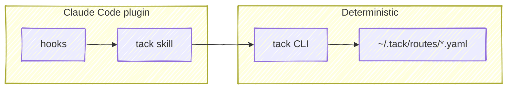

# tack — Route Schema Specification (v1)

## Overview

tack is a tool-agnostic route schema for tracking AI-assisted development
work. A route captures the non-linear, multi-project reality of how
development actually happens — pivots, context switches, expanding scope — so
that work-in-progress survives context exhaustion, crashes, and session
boundaries.

The schema is the primary deliverable. The CLI encapsulates schema
operations as a deterministic primitive. A separate Claude Code plugin
bundles hooks and a skill that layer reasoning on top — picking the active
route, prompting on ambiguity, capturing URLs — using the CLI as its only
write path.



The CLI and YAML schema are the durable, tool-agnostic layer. The plugin is
a Claude-Code-specific surface that wraps the CLI; other agents or tools can
target the same schema by speaking to the CLI directly.

---

## Data Model

```
Route (1 YAML file)
├── id (UUID), slug, created_at, updated_at
├── group (optional grouping slug)
├── depends_on: [route slugs]
├── sessions[]
│   └── id, started_at, tacks[] — route-scoped tack IDs the session is driving
└── tacks[]
    ├── id (t1, t2, ...), summary, status
    ├── done_at
    ├── depends_on: [tack IDs]
    ├── deliverable — the change request
    │   └── label, url
    ├── before[] — pre-work todos
    │   └── id (b1, b2, ...), text, done, done_at
    ├── after[] — post-work todos
    │   └── id (a1, a2, ...), text, done, done_at
    └── links[] — references (docs, issues, threads, etc.)
        └── label, url
```

```
Repo database (1 YAML file, ~/.tack/repos.yaml)
└── <normalized-remote> (map key, e.g. github.com/chris-peterson/anchor)
    ├── names[]  — names the repo is known by (derived name + custom aliases)
    └── locals[] — absolute paths of known checkouts/worktrees
```

---

## Requirements

### RTE — Route Schema

**[RTE-01]** The route schema shall use YAML as the on-disk format.

**[RTE-02]** Each route shall be stored as a single file at
`~/.tack/routes/<slug>.yaml`.

**[RTE-03]** Each route shall contain the following required fields:
- `id` (string) — a v4 UUID, generated once at creation time
- `slug` (string) — unique identifier, lowercase, hyphenated
- `created_at` (string) — ISO 8601 timestamp
- `updated_at` (string) — ISO 8601 timestamp
- `tacks` (array) — list of tack objects

**[RTE-04]** Each route shall contain the following optional fields:
- `group` (string) — a grouping slug for associating related routes. Multiple
  routes may share the same group. Uses the same format as `slug` (lowercase,
  hyphenated). The field is purely organizational — the CLI does not enforce or
  validate group membership.
- `depends_on` (array of strings) — slugs of routes that must complete before
  this one can proceed

**[RTE-05]** The `slug` field shall be unique across all route files in
`~/.tack/routes/`. When a slug matches an existing filename, the operation
shall fail with an error.

**[RTE-06]** The `updated_at` field shall be set to the current time whenever
the route file is written.

**[RTE-07]** A route shall be valid with an empty `tacks` array.

**[RTE-08]** The `id` field shall be immutable after creation. It shall not
change when the route is updated.

**[RTE-09]** Each route shall contain the following optional field:
- `sessions` (array) — Claude Code session references that touched this route

**[RTE-10]** Each session entry shall contain the following required fields:
- `id` (string) — the Claude Code session identifier
- `started_at` (string) — ISO 8601 timestamp when the session first touched
  this route

**[RTE-11]** Each session entry shall contain the following optional field:
- `tacks` (array of strings) — IDs of tacks *within this route* that the
  session is driving, in touch order. The last entry is the session's current
  focus. Because the array lives inside the route file, the IDs are bare
  route-scoped `t<N>` values; a cross-route consumer (e.g. a fleet view that
  reads every route) addresses them as `<slug>/<tack-id>` per [CLI-21a]. This
  is the session→tack link: `sessions[]` already records session→route per
  [RTE-09], and this field narrows it to the specific tack(s) a session is
  working, so a reader keyed on the Claude session id can resolve which tack a
  live session is driving — not just which route.

---

### TACK — Tacks

**[TACK-01]** Each tack shall contain the following required fields:
- `id` (string) — route-scoped identifier in the format `t<N>` where N is a
  sequential integer starting at 1
- `summary` (string) — human-readable description of the work
- `status` (string) — one of: `pending`, `in_progress`, `done`, `blocked`,
  `dropped`

**[TACK-02]** Each tack shall contain the following optional fields:
- `done_at` (string) — ISO 8601 date (`YYYY-MM-DD`) or date-time
  (`YYYY-MM-DDTHH:MM:SSZ`) when the tack was completed. The CLI writes the
  full date-time on new completions; bare dates are accepted on read for
  backward compatibility with routes created before v0.11.0.
- `depends_on` (array of strings) — IDs of tacks within the same route that
  must complete first
- `deliverable` (object) — the change request this tack produces
- `before` (array) — pre-work todo items
- `after` (array) — post-work todo items
- `links` (array) — external references

**[TACK-03]** When `status` is set to `done`, the `done_at` field shall be set
to the current ISO 8601 date-time if not already present. Callers may supply
an explicit timestamp (date or date-time) per [CLI-05] to backfill already-merged
work.

**[TACK-04]** When `status` is set to `done`, if the tack has `after` items with
`done: false`, those items shall be surfaced in the response so the calling
agent can confirm or close them out. The CLI persists the status change before
displaying the pending items; gating responsibility lies with the caller.

**[TACK-05]** Tack IDs shall be unique within a route. When a new tack is
added, its ID shall be `t<N>` where N is one greater than the highest existing
tack number.

**[TACK-06]** When a tack's `depends_on` references a tack ID that does not
exist in the route, the operation shall fail with an error.

**[TACK-07]** When a tack's `depends_on` references would create a circular
dependency, the operation shall fail with an error.

**[TACK-08]** Wherever a command argument identifies a tack — a `<tack-id>`, a
`<dep-id>`, or an entry in `--depends-on` — both the canonical `t<N>` form and
the bare `<N>` form shall resolve to the same tack. Bare ids are normalized to
`t<N>` at the lookup boundary, so the form a caller types does not change the
result or the stored value. An argument that is neither form is left unchanged
and still produces the usual "tack not found" error.

---

### DEL — Deliverable

**[DEL-01]** Each tack shall have at most one deliverable. The deliverable
represents the change request (PR/MR) that the tack produces.

**[DEL-02]** Each deliverable shall contain the following required fields:
- `label` (string) — short display text
- `url` (string) — full URL

---

### TODO — Todo Items

**[TODO-01]** The system shall represent both `before` (pre-work) and `after`
(post-work) todo items with the same item schema.

**[TODO-02]** Each todo item shall contain the following required fields:
- `id` (string) — scoped identifier: `b<N>` for before items, `a<N>` for
  after items, where N is a sequential integer starting at 1
- `text` (string) — description of the instruction
- `done` (boolean) — whether the instruction has been completed

**[TODO-03]** Each todo item shall contain the following optional fields:
- `done_at` (string) — ISO 8601 date (`YYYY-MM-DD`) or date-time
  (`YYYY-MM-DDTHH:MM:SSZ`) when completed. New writes use the full date-time;
  bare dates remain valid on read.

**[TODO-04]** When `done` is set to `true`, the `done_at` field shall be set to
the current ISO 8601 date-time if not already present.

**[TODO-05]** Todo IDs shall be unique within their respective array (before or
after). When a new todo is added, its ID shall use the next sequential number
for that array's prefix.

---

### DEP — Dependencies

**[DEP-01]** Route-level `depends_on` shall be an array of route slugs
(strings).

**[DEP-02]** Tack-level `depends_on` shall be an array of tack IDs within the
same route.

**[DEP-03]** When a tack has `depends_on` entries and any referenced tack has a
status other than `done`, the dependent tack's status shall not be set to
`in_progress` — the operation shall fail with an error indicating which
dependencies are unmet.

**[DEP-04]** Route-level dependencies shall be informational. The CLI shall
display them in `tack status` output but shall not enforce them (the referenced
route files may not exist locally).

---

### LINK — Links

**[LINK-01]** Each link shall contain the following required fields:
- `label` (string) — short display text
- `url` (string) — full URL

---

### STG — Storage

**[STG-01]** Route files shall be stored in `~/.tack/routes/`.

**[STG-02]** The storage directory shall be created automatically on first use
if it does not exist.

**[STG-03]** Route filenames shall match the pattern `<slug>.yaml`.

**[STG-04]** The JSON Schema at `schema/route.schema.json` shall be the
canonical validation source for route files.

**[STG-05]** When reading a route file, the CLI shall validate it against the
JSON Schema. If validation fails, the CLI shall report the errors and exit
without modifying the file.

**[STG-06]** Pins shall be stored in a single YAML file at `~/.tack/pins.yaml`,
a map keyed by absolute working-directory path. Each entry has the following
fields:
- `slug` (string, required) — the pinned route's slug
- `pinned_at` (string, required) — ISO 8601 timestamp of when the pin was
  written
- `session_id` (string, optional) — informational; the Claude Code session
  that wrote the pin

tack shall never write state into the working directory itself — a state
file in the project tree is one `git add .` away from being committed to a
repo where it has no business. All tack state lives under `~/.tack/`.

---

### CLI — CLI

**[CLI-01]** The CLI shall be invoked as `tack <command> [options]`.

**[CLI-02]** `tack init <slug> [--group <slug>]` — When invoked, the CLI shall
create a new route file at `~/.tack/routes/<slug>.yaml` with a generated v4
UUID as `id`, an empty `tacks` array, and `created_at`/`updated_at` set to
the current time. When `--group` is passed, the route's `group` shall be set
to the given slug. When the `CLAUDE_CODE_SESSION_ID` environment variable is
set (the CLI is running inside a Claude Code session), the CLI shall also
record that session on the route per [RTE-09] — route-level, without binding a
tack ([RTE-11] binding is reserved for [CLI-07] / [CLI-17], which know the tack).
Creating a route in a session is a declaration that the session is working it,
so a fleet reader keyed on the session id attributes the session to the route
with no separate `tack session` call. Outside a Claude session this is a no-op.

**[CLI-03]** `tack status [slug] [--all]` — When invoked with a slug, the CLI
shall display the route's tacks, their statuses, dependencies, deliverable,
and any pending todo items. Tacks with status `dropped` shall be omitted by
default; when `--all` is passed, dropped tacks shall be included. When invoked
without a slug, the CLI shall display a summary of all routes.

**[CLI-04]** `tack add <slug> <summary> [--depends-on <id,...>] [--done] [--date <ts>] [--deliverable <url>] [--link "label,url"]...` —
When invoked, the CLI shall add a new tack to the specified route with the
next sequential ID. When `--done` is passed, the tack shall be created with
status `done` and `done_at` set to the current ISO 8601 date-time, or to the
explicit value of `--date <ts>` (a `YYYY-MM-DD` date or full ISO 8601
date-time) when supplied — this is the supported path for backfilling
already-merged work. When `--deliverable <url>` is passed, the tack shall be
created with its `deliverable` field set; the label is auto-derived from the
URL using the recognition rules in [CLI-37]. When the URL does not match
a recognized pattern, the URL itself is used as the label. `--link` is
repeatable and attaches a link per invocation; each value is `"label,url"`
split on the first comma (matching `tack link add`'s `<label> <url>` pair per
[CLI-13]), and a value with no comma is rejected with a usage error. Links are
deduplicated on creation against the deliverable and one another, consistent
with [CLI-13]. The CLI shall
reject unknown flags with a usage error rather than silently ignoring them.
When the `CLAUDE_CODE_SESSION_ID` environment variable is set, the CLI shall
also record that session on the route per [RTE-09], route-level (as [CLI-02]
does for `tack init`).

**[CLI-05]** `tack done <slug> <tack-id> [--date <ts>]` — When invoked, the CLI
shall set the specified tack's status to `done`. `done_at` shall be set to the
current ISO 8601 date-time, or to the explicit value of `--date <ts>`
(`YYYY-MM-DD` or full ISO 8601 date-time) when supplied — used to backfill
work that merged on a prior date. If the tack has pending `after` items, they
shall be displayed. If the tack has no deliverable and its `links` array
contains exactly one PR/MR URL, that link shall be promoted to the tack's
deliverable and removed from `links`. If the tack has no deliverable and the
`links` array contains two or more PR/MR URLs, the CLI shall not promote any
of them — the status change still completes, and the CLI shall emit a warning
to stderr naming the candidates and the `tack deliverable` command to pick
one.

**[CLI-06]** `tack drop <slug> <tack-id>` — When invoked, the CLI shall set the
specified tack's status to `dropped`. The tack shall remain in the route file
as a historical record of intentionally descoped work. To permanently delete a
tack created in error, use [CLI-25].

**[CLI-07]** `tack start <slug> <tack-id>` — When invoked, the CLI shall set
the specified tack's status to `in_progress`. If the tack has `depends_on`
entries with unmet dependencies, the operation shall fail per [DEP-03]. The
error message shall guide the user to either drop the edge with
[CLI-33] (`tack depends rm`) when the declared ordering no longer holds, or
to bypass the guard with [CLI-34] (`tack status set`) when the inconsistent
state is intentional. When the `CLAUDE_CODE_SESSION_ID` environment variable
is set (the CLI is running inside a Claude Code session), the CLI shall also
bind that session to the started tack per [RTE-11] / [CLI-17] — starting a tack
in a session is the declaration that the session is driving it, so a fleet
reader keyed on the Claude session id (e.g. beacon) can attribute the session
to the tack with no separate `tack session --tack` call. Outside a Claude
session (variable unset) this is a no-op.

**[CLI-08]** `tack deliverable <slug> <tack-id> <url> [--label <text>] [--force]` —
When invoked, the CLI shall set the deliverable on the specified tack. The
label is auto-derived from the URL using the recognition rules in [CLI-37];
`--label <text>` overrides the derived label and is used verbatim. The CLI
shall require exactly the three positionals `<slug> <tack-id> <url>` and fail
with a usage error otherwise. If the tack already has a deliverable, the CLI
shall fail with an error showing the existing deliverable's label and URL
unless `--force` is passed. The overwrite guard prevents typo'd tack IDs from
silently clobbering an unrelated tack's deliverable.

**[CLI-08a]** `tack deliverable rm <slug> <tack-id> [--to-link]` — When
invoked, the CLI shall remove the deliverable from the specified tack — the
inverse of [CLI-08]. By default the tack is left with no deliverable. When
`--to-link` is passed, the deliverable shall instead be relocated into the
tack's `links` array preserving its label and URL, so the URL is never lost in
the transition; if that URL is already present in `links`, the relocation is a
no-op on the link (no duplicate), consistent with [CLI-13]. If the tack has no
deliverable, the CLI shall fail with a clear message. The `rm` subcommand does
not rename the set form of [CLI-08], which keeps its bare `<slug> <tack-id>
<url>` positional grammar.

**[CLI-09]** `tack before <slug> <tack-id> <text>` — When invoked, the CLI
shall add a pre-work todo item to the specified tack with `done: false`.

**[CLI-10]** `tack after <slug> <tack-id> <text>` — When invoked, the CLI
shall add a post-work todo item to the specified tack with `done: false`.

**[CLI-11]** `tack todo done <slug> <tack-id> <todo-id>` — When invoked, the
CLI shall mark the specified todo item as `done: true` and set `done_at` to
the current date per [TODO-04].

**[CLI-12]** `tack todo rm <slug> <tack-id> <todo-id>` — When invoked, the CLI
shall delete the specified todo item from its array.

**[CLI-13]** `tack link add <slug> <tack-id> <label> <url>` — When invoked,
the CLI shall add a link to the specified tack's `links` array. The URL
is always recorded as a link, even when it matches a PR/MR pattern (the
recognized forges are defined in [CLI-37]);
setting a deliverable is the separate, explicit operation of
`tack deliverable` ([CLI-08]). If the URL already exists on the tack (as
the `deliverable` URL or in `links`), the CLI shall not add a duplicate.

**[CLI-14]** `tack list` — When invoked, the CLI shall list all route files in
`~/.tack/routes/` with their slug, number of tacks, and number of open tacks.

**[CLI-15]** `tack rm <slug> [--force]` — When invoked, the CLI shall delete
the route file at `~/.tack/routes/<slug>.yaml`. The CLI shall require
`--force` to confirm deletion; without it, the CLI shall display a
confirmation message and exit without deleting.

**[CLI-16]** When any write command succeeds, the CLI shall display the updated
state of the affected tack or route.

**[CLI-17]** `tack session <slug> <session-id> [--tack <tack-id>]` — When
invoked, the CLI shall record the session ID in the route's `sessions` array
per [RTE-09]. If the session ID already exists, it shall not duplicate. When
`--tack <tack-id>` is passed, the CLI shall bind the session to that tack per
[RTE-11]: the tack ID is appended to the session entry's `tacks` array (bare
`<N>` is normalized to `t<N>` per [TACK-08]). A tack already present in the
array is moved to the end rather than duplicated, so the last entry is always
the session's current focus and a pivot back to an earlier tack makes it
current again. The CLI shall fail if `<tack-id>` does not exist in the route.

**[CLI-18]** `tack list [--json]` and `tack status [slug] [--json]` — When
`--json` is passed, the CLI shall output the result as JSON instead of the
default text format.

**[CLI-19]** `tack completions <shell>` — When invoked, the CLI shall install
shell tab completions. Supported shells: `zsh`.

**[CLI-19a]** `tack install-cli [--dir <path>]` — In addition to dropping the
`tack` wrapper on PATH, the CLI shall install the zsh completion script (the
same artifact `tack completions zsh` produces). A single invocation
provisions both PATH access and tab completion.

**[CLI-20]** When tab completing tack IDs, the shell shall display each tack's
summary as a completion description alongside the ID.

**[CLI-21]** `tack tree [path] [-d <depth>]` — When invoked without a path, the
CLI shall display all routes as a navigable tree.

**[CLI-21a]** The `path` argument uses `/`-separated segments supporting three
levels:
- `<slug>` — display that route's tacks
- `<slug>/<tack-id>` — display that tack's details
- `<slug>/<tack-id>/<aspect>` — display only that aspect (`deliverable`,
  `before`, `after`, `links`, `depends_on`)

**[CLI-21b]** Path segments may contain glob wildcards (`*`, `?`, `**`) which
match against values at that level. `*` matches within a single segment, `**`
matches across segment boundaries (e.g., `**/deliverable` finds deliverables at
any depth, `ai-sdlc/**` shows everything under a route). Glob paths must be
quoted to prevent shell expansion.

**[CLI-21c]** The `-d`/`--depth` option controls expansion: depth 1 = routes
only, depth 2 = routes + tacks, depth 3 = routes + tacks + details. Default
depth is 1 when no path is given, 2 when a route path is given.

**[CLI-21d]** Tab completion for the `path` argument shall resolve each level
progressively with `/` suffixes, allowing filesystem-style drill-down without
retyping.

**[CLI-22]** `tack recent [--count <n>] [--since <date>]` — When invoked, the
CLI shall list routes sorted by `updated_at` descending, showing each route's
slug, last-updated time, and a summary of open tacks. The `--count` option
limits the number of results (default: 10). The `--since` option filters to
routes with `updated_at` on or after the given ISO 8601 date (e.g.,
`2026-04-01`).

**[CLI-24]** When displaying individual tack state in text output, the CLI shall
prefix the tack ID with a bracketed status icon: `[ ]` pending, `[>]`
in_progress, `[x]` done, `[!]` blocked, `[-]` dropped. Todo items shall use
`[x]` for done and `[ ]` for not done.

**[CLI-23]** `tack find <url> [--json]` — When invoked, the CLI shall search all
routes for tacks whose deliverable URL or link URLs match the given URL, and
display each match as a tree: route slug, tack summary, and the matching
deliverable or link. When `--json` is passed, the CLI shall output the results
as JSON. If no matches are found, the CLI shall report that no tacks reference
the given URL.

**[CLI-25]** `tack remove <slug> <tack-id> [--force]` — When invoked, the CLI
shall delete the specified tack from the route's `tacks` array. The tack's ID
shall not be reused; subsequent tacks shall continue the sequence per [TACK-05].
If any other tack's `depends_on` array references the tack being deleted, the
operation shall fail with an error listing the dependents, unless `--force` is
passed. When `--force` is passed, the references to the deleted tack shall be
stripped from all dependent tacks' `depends_on` arrays.

**[CLI-26]** `tack link rm <slug> <tack-id> <url>` — When invoked, the CLI
shall remove the link with the matching URL from the specified tack's
`links` array. If no link with that URL exists, the CLI shall fail with
an error.

**[CLI-27]** `tack edit <slug> <tack-id> <summary>` — When invoked, the CLI
shall update the specified tack's `summary` field in place and refresh
`updated_at`.

**[CLI-28]** `tack merge <slug> <source-id> <target-id>` — When invoked, the
CLI shall merge the source tack into the target: todos (`before`/`after`)
and `links` are appended to the target (with new sequential todo IDs); if
the source has a `deliverable` and the target does not, the deliverable is
moved to the target; if both tacks have a deliverable, the target's
deliverable is kept and the source's is discarded. The source tack is then
removed from the route's `tacks` array, leaving a single surviving tack. The
source ID shall not be reused; subsequent tacks continue the sequence per
[TACK-05] (consistent with `tack remove`, [CLI-25]).

> Note: callers wanting to preserve a source deliverable when both tacks
> have one should record it as a link on the target before merging.

**[CLI-29]** `tack --version` / `tack -v` — When invoked, the CLI shall print
the `version` field of `.claude-plugin/plugin.json` (resolved from the
plugin root) and exit zero.

**[CLI-30]** `tack pin <slug>` — When invoked, the CLI shall record the given
slug as the active route for the current working directory in
`~/.tack/pins.yaml` per [STG-06]. The CLI shall fail if no route file exists
for the given slug. When invoked without arguments (`tack pin`), the CLI
shall display the current cwd's pin and exit zero if one exists, or report
that no pin is set and exit non-zero.

**[CLI-31]** `tack unpin` — When invoked, the CLI shall remove the current
working directory's entry from `~/.tack/pins.yaml` if one exists. The
command shall succeed silently if no pin is set; absence of a pin is not an
error.

**[CLI-32]** `tack depends add <slug> <tack-id> <dep-id>` — When invoked, the
CLI shall append `<dep-id>` to the specified tack's `depends_on` array. If
the dependency already exists, the operation shall be a no-op (idempotent).
The CLI shall reject self-dependencies and shall reject additions that would
introduce a circular dependency, consistent with [TACK-07].

**[CLI-33]** `tack depends rm <slug> <tack-id> <dep-id>` — When invoked, the
CLI shall remove `<dep-id>` from the specified tack's `depends_on` array. If
the array becomes empty, the field shall be omitted from the YAML. If
`<dep-id>` is not present, the CLI shall fail with an error.

**[CLI-34]** `tack status set <slug> <tack-id> <status>` — When invoked, the
CLI shall set the specified tack's `status` field to the given value
(`pending`, `in_progress`, `done`, `blocked`, or `dropped`) without enforcing
[DEP-03] dependency guards. When the new status is `done` and `done_at` is
not already set, the CLI shall stamp `done_at` per [TACK-03]. This command is
the supported escape hatch for representing states the guarded commands
([CLI-05], [CLI-06], [CLI-07]) refuse to produce (e.g., reverting a `done` tack
to `pending`, or putting a tack into `blocked`).

**[CLI-35]** `tack rename <old-slug> <new-slug>` — When invoked, the CLI
shall rename the route file from `<old-slug>.yaml` to `<new-slug>.yaml` and
update the `slug` field inside the file. The route's `id` ([RTE-08]) shall
be preserved. The CLI shall fail if `<new-slug>` already exists as a route,
if `<old-slug>` does not exist, or if any other route's `depends_on`
references `<old-slug>` (per [DEP-01]).

**[CLI-36]** `tack move <src-slug>/<tack-id> <dst-slug> [--include-dependents]`
— When invoked, the CLI shall remove the specified tack from the source
route's `tacks` array and append it to the destination route's `tacks` array.

**[CLI-36a]** The moved tack shall receive a new sequential ID per [TACK-05] (ID
continues from the destination's existing maximum; source IDs are not reused
per [CLI-25]). All tack metadata — `summary`, `status`, `done_at`,
`deliverable`, `links`, `before`, `after` — shall be preserved verbatim.

**[CLI-36b]** Because tack IDs are route-local per [TACK-05], `depends_on`
references cannot cross route boundaries. The CLI shall refuse the move if the
tack being moved has any incoming or outgoing `depends_on` edge that would
cross the boundary (a moving tack depending on a staying tack, or a staying
tack depending on a moving tack), and shall display each offending edge in the
error so the user can resolve it with [CLI-33] (`tack depends rm`) or by
including the dependent chain.

**[CLI-36c]** When `--include-dependents` is passed, the move set is expanded to
the transitive closure of tacks that depend on the source tack within the
source route. Their `depends_on` arrays are rewritten to reference the new IDs
assigned in the destination. The cross-boundary refusal of [CLI-36b] still
applies — if any staying tack depends on a moving tack, the move shall fail.

**[CLI-36d]** The CLI shall fail if `<src-slug>` and `<dst-slug>` are the same
route, if either route does not exist, or if `<tack-id>` does not exist in the
source route.

**[CLI-37]** The PR/MR/issue URL recognition used for deliverable
auto-derivation and label extraction ([CLI-04], [CLI-08], [CLI-13]) shall support
two forges: GitHub (`https://github.com/<owner>/<repo>/pull/<n>` and
`/issues/<n>`) and GitLab (`https://gitlab.<host>/<group>/<repo>/-/merge_requests/<n>`
and `/-/issues/<n>`). The derived label is `<repo>#<n>` for a PR or issue and
`<repo>!<n>` for an MR. URLs from other forges are recorded verbatim as links
or labels but are not classified as PR/MR/issue. The hook scanners ([HOOK-02],
[HOOK-03]) recognize the same two forges.

**[CLI-37a]** Commit URLs — `https://github.com/<owner>/<repo>/commit/<sha>` and
`https://gitlab.<host>/<group>/<repo>/-/commit/<sha>` — are additionally
recognized for label derivation ([CLI-04], [CLI-08]), producing a
`<repo>@<sha7>` label from the first seven characters of the sha. A commit is
not a PR/MR/issue: it is not promoted to a deliverable on `tack done` ([CLI-05])
and is not surfaced by the hook scanners ([HOOK-02], [HOOK-03]).

**[CLI-38]** `tack --help` / `tack -h` / `tack help` — When invoked, the CLI
shall print the usage text to stdout and exit zero. The `--help` / `-h` flag
shall be honored after any subcommand as well (e.g. `tack session --help`,
`tack pins --help`): the CLI shall print the usage text to stdout and exit
zero rather than treating the flag as a subcommand argument — which would
otherwise throw on subcommands parsed strictly, or be silently ignored by
subcommands that parse flags manually. When invoked with no arguments or with
an unrecognized command, the CLI shall print the same usage text to stderr
and exit non-zero; the unrecognized-command case shall name the offending
command.

**[CLI-39]** `tack pins [--json]` — When invoked, the CLI shall list every pin
in `~/.tack/pins.yaml` ([STG-06]) with its directory, slug, and `pinned_at`
timestamp, flagging entries whose route no longer exists (dangling) and
entries whose route has no open tacks (idle). With `--json`, the CLI shall
emit the structured pin list including the computed flags. The command shall
exit zero even when the list is empty.

**[CLI-40]** `tack pins prune` — When invoked, the CLI shall remove every pin
whose route no longer exists and every pin whose directory no longer exists
on disk, displaying each removed entry and the reason (dangling route /
missing directory). Pins to existing routes with no open tacks shall be
kept — idle is informational ([CLI-39]); they are removed only by explicit
`tack unpin` ([CLI-31]).

**[CLI-41]** Subcommand-group verbs (`tack status set`, `tack todo`, `tack
link`, `tack depends`) invoked without a valid subcommand shall print a
group-scoped error to stderr that names the offending input and the accepted
subcommands (e.g. `tack link: expected 'add' or 'rm' (got 'my-slug')`), then
exit non-zero — rather than dumping the global usage text. This keeps the
failure visible to scripted callers that quiet or capture one stream;
contrast the global-usage fallback of [CLI-38] for top-level errors.

**[CLI-42]** `tack repo <partial> [--json]` — When invoked, the CLI shall match
`<partial>` case-insensitively against every repo's `names` in
`~/.tack/repos.yaml` ([REPO-01]) and report each matched repo's remote as an
HTTPS URL (`https://<key>`). With exactly one match, the CLI shall print the
URL; with several, it shall list them; with none, it shall exit non-zero with a
not-found message. With `--json`, the CLI shall emit the structured match list.

**[CLI-43]** `tack repo [--json]` (no positional argument) — When invoked, the
CLI shall list every repo in the database with its `names` and existing
`locals`. With `--json`, the CLI shall emit the structured repo list. The
command shall exit zero even when the database is empty.

**[CLI-44]** `tack repo alias <match> <alias>` — When invoked, the CLI shall add
`<alias>` to the matched repo's `names`. If `<match>` resolves to more than one
repo, the CLI shall fail and list the candidates.

**[CLI-45]** `tack repo prune` — When invoked, the CLI shall remove from every
repo's `locals` any path that no longer exists on disk, displaying each removed
path. It shall not remove repo entries themselves; a repo with no locals (e.g.
one captured from a URL but never cloned) is retained.

**[CLI-46]** `tack repo rm <match>` — When invoked, the CLI shall remove the
matched repo entry. If `<match>` resolves to more than one repo, the CLI shall
fail and list the candidates.

**[CLI-47]** `tack repo rebuild` — When invoked, the CLI shall reconstruct the
repo database from existing tack data: every deliverable and link URL across all
routes that parses as a forge change reference ([REPO-06]), and every existing
pinned directory's `origin` remote ([REPO-07]). The rebuild is additive — it adds
names and locals but removes nothing, so custom aliases ([CLI-44]) survive a
re-run. It backfills the database for routes recorded before capture existed.

**[CLI-48]** Duplicate-URL warning — When a URL is attached as a deliverable
(`tack add --deliverable`, `tack deliverable`) or a link (`tack link add`),
the CLI shall check whether the same URL already appears as a deliverable or
link on any other tack (the same exact-URL match as `tack find`, [CLI-23]), and
if so shall print a warning to stderr that names the existing route(s) and tack
id(s) with a `warning: url already on ` prefix. The tack being mutated is
excluded, so re-attaching a URL already present on that same tack does not
warn. The warning is informational: the attach still completes and the command
exits zero.

**[CLI-49]** Export — `tack export [--out-file <path>] [--compress]` shall
serialize the entire local store (all routes, the repo database, and pins) as a
single JSON document carrying a top-level `schemaVersion` (currently `1`), an
`exportedAt` ISO timestamp, and a `generator` string. It shall write the archive
uncompressed to stdout by default; `--out-file` shall redirect it to a file
(emitting the summary line to stderr) and `--compress` shall gzip the output.

**[CLI-50]** Import — `tack import <file> [--merge|--replace] [--dry-run]` shall
read an archive produced by [CLI-49] — gzip-compressed or plain JSON, detected by
content — and refuse one whose `schemaVersion` exceeds the running tack's. `--replace` (full restore) shall overwrite each
route in the archive verbatim and replace the repo database and pins wholesale.
`--merge` (the default, for combining machines) shall: create routes absent
locally; for a route that exists on both, append only tacks whose identity
(deliverable URL, else summary + `done_at`) is not already present, assigning
fresh ids and remapping `depends_on` edges to those ids; union repo *names*
while ignoring machine-specific repo `locals`; and skip pins. It shall report
every `old id → new id` reassignment. `--dry-run` shall report the outcome
without writing.

---

### AGT — Agent Integration

The CLI encapsulates schema operations; the skill encapsulates reasoning.
Inference (what's active, which route to attach to, when to prompt) lives in
the skill and uses CLI primitives. Hooks emit reminders (see HK); the skill
acts on them.

**[AGT-01]** The agent shall be implemented as a Claude Code skill that reads
and writes tack route files using the CLI defined in the CLI category.

**[AGT-02]** When a session begins, the plugin's skill shall load all active
routes (routes with at least one tack whose status is not `done` or `dropped`)
to build context about current work.

**[AGT-03]** The agent shall maintain the answer to "what am I working on?"
for the current working directory by running the following resolution
procedure in order, stopping at the first confident match:

1. **Pin** — Run `tack pin` (no slug) to read the cwd's pin per [STG-06]. If
   present and the referenced route exists with at least one open tack, the
   pinned route is active.
2. **URL match** — When a PR/MR/issue URL is in scope (recently emitted by
   a tool, pasted by the user, or passed as a hint), run `tack find <url>
   --json` and use the matched route if exactly one is returned. The matched
   tack is also the session's tack per [AGT-11] — bind it via [AGT-09].
3. **Branch slug** — When the cwd is a git repository, run `tack list
   --json` and use the route whose slug equals the current branch name if
   it has at least one open tack.
4. **Single open route** — If exactly one route has an open tack, use it.
5. **Ambiguous or unknown** — Prompt the user via `AskUserQuestion` with
   candidates: in-progress routes, recently-updated routes (via `tack
   recent --json`), or a "start a new route" option. On the user's pick,
   record the answer with `tack pin <slug>` per [AGT-10].

**[AGT-04]** When the user confirms a new route during resolution per [AGT-03],
the agent shall run `tack init <slug>` and add the first tack with `tack add`.

**[AGT-05]** When a hook emits a deliverable reminder per [HOOK-02], or a PR/MR
URL otherwise appears in the session, the agent shall record the URL on the
active route's current tack via `tack deliverable <slug> <tack-id> <label>
<url>` without prompting the user. If no active tack exists, the agent shall
add one with `tack add` and then record the deliverable.

**[AGT-06]** When a hook emits a link reminder per [HOOK-02], or a non-PR/MR
URL is referenced in the session, the agent shall capture it via `tack link
add <slug> <tack-id> <label> <url>` on the active tack. URLs already recorded
as a deliverable per [AGT-05] shall not be duplicated; the CLI enforces this
per [CLI-13].

**[AGT-07]** The agent shall not prompt the user more than once per distinct
event. If the user ignores or dismisses a prompt, the agent shall not re-ask
about the same work item in the same session.

**[AGT-08]** When the user completes a tack, the agent shall surface any
pending `after` todo items per [TACK-04] before moving on.

**[AGT-09]** When the agent begins operating on a route, it shall record the
current Claude Code session ID in the route's `sessions` array per [RTE-09].
If the session ID already exists, it shall not duplicate. When the agent has
resolved which tack the session is working — a tack matched per [AGT-11], the
single open tack, or one the agent created for this session — it shall pass
`--tack <tack-id>` to bind the session to that tack per [RTE-11], and re-bind
when the session's focus shifts to a different tack.

**[AGT-11]** The agent shall establish the session→tack link as early as it
confidently can, so a fleet view can distinguish *existing* work (a session
resumed on tracked work) from *emerging* work (a session that spun up a new
tack). When a PR/MR/issue/tracker URL is in scope at session start (pasted by
the user, passed as a hint, or emitted by a tool per [HOOK-02]/[HOOK-03]), the
agent shall run `tack find <url> --json` per [CLI-23]:
- **Match** — exactly one tack references the URL: the session is resuming
  existing work. The agent shall bind the session to that tack per [AGT-09].
- **No match** — the work is emerging. The agent shall create a tack per
  [AGT-04]/[AGT-05] (recording the URL as its deliverable or link) and bind the
  session to the new tack.

The existing-vs-emerging distinction is not stored as a flag; a consumer
derives it from the bound tack's own state — a tack carrying a deliverable or
a PR/MR/issue link ([CLI-37]) is tracked/existing, one with neither is
emerging.

**[AGT-10]** When the agent resolves an active route via [AGT-03] in a way
that is not already pinned (URL match, branch slug, single-open-route, or
user pick), the agent shall pin the result with `tack pin <slug>` so future
resolutions are immediate. The agent shall not pin speculatively — only
after a confident match or user confirmation. The agent shall `tack unpin`
when the user explicitly switches focus or when the pinned route's last open
tack transitions to `done` or `dropped`.

---

### HOOK — Hooks

Hooks are scaffolding around the agent. They surface signals the agent might
otherwise miss (URLs in tool output, URLs in user prompts, version drift),
and they emit reminder text the agent reads as additional context. Hooks
never write to route files directly; the skill performs all writes via the
CLI per [AGT-05] and [AGT-06].

**[HOOK-01]** A `SessionStart` hook shall compare the installed CLI wrapper's
version to the plugin's `version` per [CLI-29]. When they differ, the hook
shall emit a one-line note suggesting `tack install-cli`. The hook shall
silently no-op when `tack` is not on `PATH` and shall never block session
start.

**[HOOK-02]** A `PostToolUse` hook scoped to the `Bash` tool shall scan tool
output for PR/MR and issue URLs (the recognized forges are defined in
[CLI-37]). For each match, the hook shall first check whether a tack already
tracks the URL by running `tack find <url>` ([CLI-23]); a URL already mapped
emits no reminder, so the hooks stop nagging about work that is already
recorded. Only an untracked URL shall emit reminder text, instructing the
agent to ensure a route/tack mapping exists via the tack skill per [AGT-05] or
[AGT-06] depending on URL type. When `tack` is not on `PATH` the tracked-check
cannot run, so the hook shall emit the reminder unconditionally.

**[HOOK-03]** A `UserPromptSubmit` hook shall scan the user's prompt for
PR/MR and issue URLs ([CLI-37]) and emit the same kind of reminder as
[HOOK-02], with the same already-tracked gating. The
hook is responsible for noticing URLs the user pastes inline rather than
through a Bash tool call.

**[HOOK-04]** The `UserPromptSubmit` hook shall also, once per session, resolve
the route for the current cwd by running [AGT-03] step 1 (pin for cwd, via
`tack pin`) and step 3 (branch-slug route) — existence-only, without verifying
the route's open-tack state and without prompting the user. When a route
resolves, the hook shall record the current session on it per [RTE-09]
(route-level, no tack binding), so session→route attribution does not depend on
the agent remembering to run `tack session`. When neither resolves, the hook
shall emit a one-line nudge suggesting the user invoke the tack skill to
identify or create a route. The hook shall debounce so this fires at most once
per session.

**[HOOK-05]** Hook reminders are advisory: the *judgment-laden* writes — which
slug and tack a URL maps to — shall be made by the agent via the tack skill,
not by the hook, so that context the hook cannot see is applied and those
schema writes go through one path. The hook may perform deterministic reads
(the `tack find` tracked-check per [HOOK-02]) and the route-level session record
per [HOOK-04], which need no such judgment.

---

### REPO — Repo Database

The repo database is a standalone index that maps the names a git repository is
known by to its remote, accumulated as tack observes work. It answers "what is
the remote for the repo I call `<name>`?" independently of any route. "Repo"
here means a git repository identified by its remote — a forge-neutral term
(GitHub's "repository"/"Projects" and GitLab's "project"/"repository" each carry
platform-specific meaning) and distinct from the project-management sense ruled
out in the Anti-Requirements.

**[REPO-01]** The repo database shall be stored as a single YAML file at
`~/.tack/repos.yaml`, a map keyed by each repo's normalized remote.

**[REPO-02]** A repo key shall be its git remote normalized to scheme-less
`host/path` form: the URL scheme and any `git@host:` or `ssh://` prefix removed,
the host and path joined with `/`, and a trailing `.git` stripped — so the HTTPS
and SSH forms of one remote resolve to a single entry (e.g.
`github.com/chris-peterson/anchor`).

**[REPO-03]** Each repo entry shall contain the following fields:
- `names` (array of strings, required) — the names the repo is known by: the
  auto-derived repo name (the last path segment of the key) plus any custom
  aliases. Lookup matches `<partial>` against this list.
- `locals` (array of strings, optional) — absolute paths of known local
  checkouts or worktrees of the repo.

**[REPO-04]** The `~/.tack/repos.yaml` file and the `~/.tack/` directory shall be
created automatically on first write if they do not exist.

**[REPO-05]** The repo database is internal derived state, like pins ([STG-06]):
tack is its sole writer, so — unlike the route schema, which is the product —
it is not governed by a published JSON Schema. A missing file shall be treated
as an empty database.

**[REPO-06]** When the CLI records a deliverable or link URL that parses as a
forge change reference ([CLI-37]), it shall upsert a repo keyed by the URL's
normalized remote ([REPO-02]) and add the derived repo name to `names` if absent.
Capture is best-effort: a failure to update the repo database shall not fail
the command that triggered it.

**[REPO-07]** When `tack init` or `tack pin` runs inside a git working directory,
the CLI shall read that directory's `origin` remote (a read-only git query)
and, when one is present, upsert the corresponding repo ([REPO-02]) and add the
absolute working-directory path to `locals` if absent. When no `origin` remote
is present, the CLI shall record nothing and shall not error.

---

## Future Requirements

**[FUT-01]** (→ BK) Where backup is enabled, the `~/.tack/` directory shall be
a git repository. Route file changes shall be the only tracked content.

**[FUT-02]** (→ BK) `tack backup init [<remote-url>]` — When invoked, the CLI
shall initialize a git repository at `~/.tack/` if one does not exist. When a
remote URL is provided, it shall be configured as the `origin` remote.

**[FUT-03]** (→ BK) `tack backup status` — When invoked, the CLI shall display
whether backup is enabled, the configured remote (if any), the last commit
timestamp, and whether there are uncommitted changes.

**[FUT-04]** (→ BK) Where backup is enabled, the CLI shall commit all route
file changes after every write operation. The commit message shall include the
command that triggered the write (e.g., "tack done api-auth t2").

**[FUT-05]** (→ BK) Where a remote is configured, the CLI shall push to the
remote after each commit. If the push fails, the CLI shall warn but not block
the operation.

---

## Anti-Requirements

The following are explicitly out of scope:

- **No project management.** No sprints, epics, story points, or velocity.
- **No time tracking.** No start times, durations, or estimates.
- **No git operations.** tack does not create branches, commits, or tags.
- **No enforced workflows.** No prescribed state machines beyond the status
  enum. Users can move between statuses freely (except where dependencies
  constrain transitions per [DEP-03]).
- **No server, sync, or cloud.** Local files only. (Backup to a git remote
  per [FUT-01] is a planned exception — core operations never require network.)
- **No cross-route dependency enforcement.** Route-level `depends_on` is
  informational only per [DEP-04].
